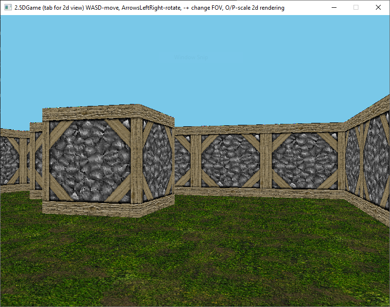
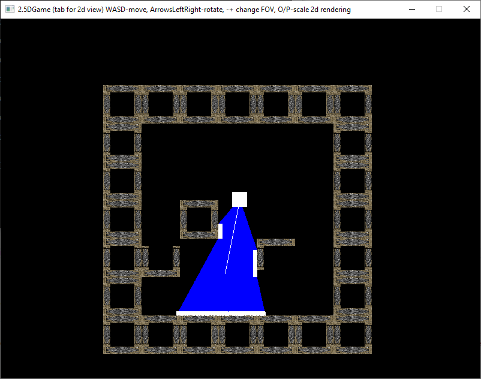
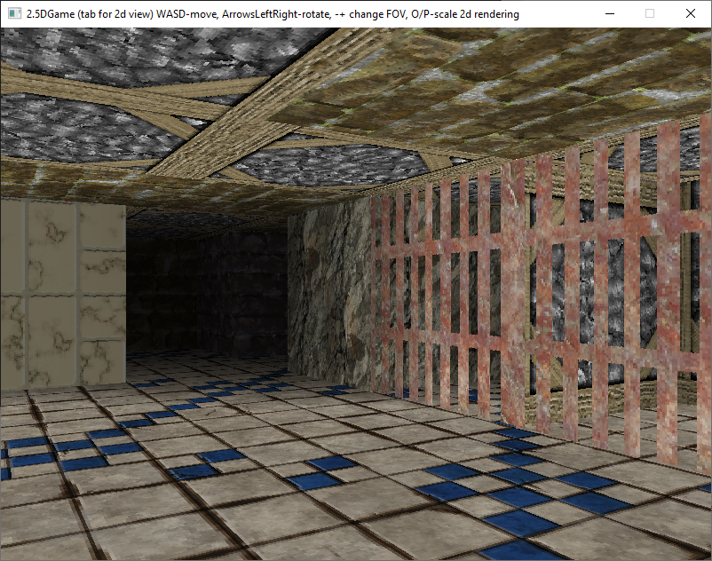
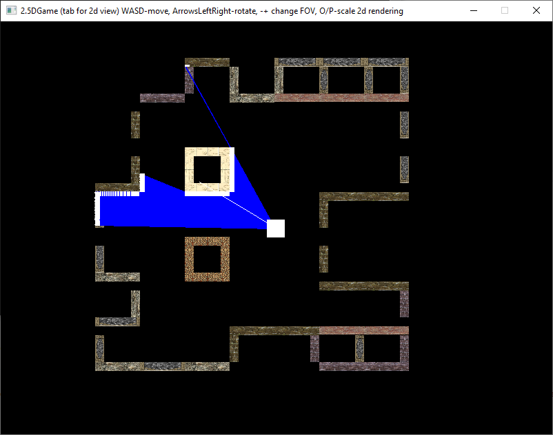

This is demo project for HumansVsGoblinsEngine.
There are 2 maps:

	demoMapExterior.map
	demoMapInterior.map

All images used are from `https://opengameart.org/`. In each map file there is list of images and links to each of them.

# Controls

* `WASD` : movement
* `LeftArrow/RightArraw` : camera rotation
* `Numpad-+` : change horizontal FOV
* `OP` : scale the map in 2D rendering mode

# demoMapExterior.map

# demoMapInterior.map

